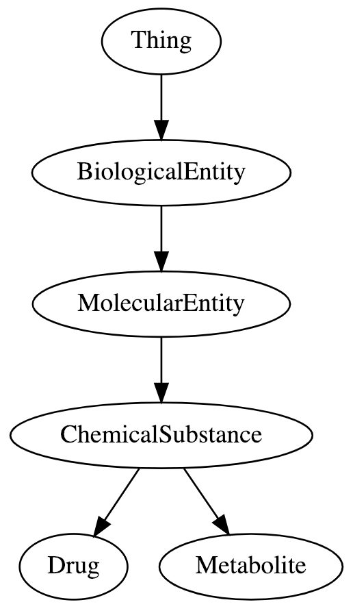

.. biothings_schema.py documentation master file, created by
   sphinx-quickstart on Wed Jan 30 15:48:16 2019.
   You can adapt this file completely to your liking, but it should at least
   contain the root `toctree` directive.

Welcome to biothings_schema.py's documentation!
===============================================
biothings_schema.py python package provides simple-to-use functions for users to visualize, edit and validate schemas defined using `Schema.org <http://schema.org/>`_ standard.

* Import biothings_schema.py package

    .. code-block:: python

        In [1]: import biothings_schema

* Visualize Schema

    .. code-block:: python

        In [2]: explorer = biothings_schema.SchemaExplorer()
        In [3]: partial_schema = explorer.sub_schema_graph(source="ChemicalSubstance", direction="both")

   Partial schema containing "ChemicalSubstance"

* Validate Schema
    
    .. code-block:: python

        In [4]: validator = biothings_schema.SchemaValidator(explorer.schema)
        In [5]: validator.validate_full_schema()

.. toctree::
   :maxdepth: 2
   :caption: Contents:

Indices and tables
==================

* :ref:`genindex`
* :ref:`modindex`
* :ref:`search`
